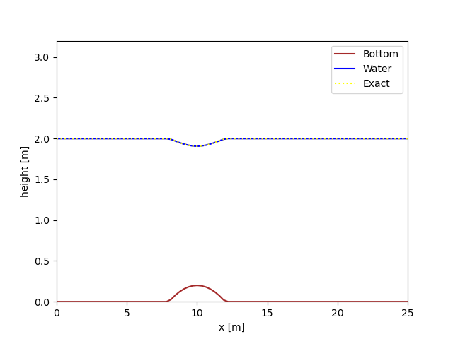
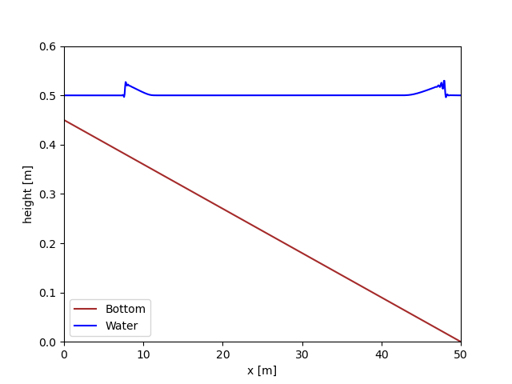

# Simulating the Shallow Water Equations with an SBP-SAT scheme
The shallow water equations are a system of partial differential equations used to
model fluid flow in situations where the horizontal length scales are much larger
than the vertical depth. 

The shallow water equations cannot generally be solved analytically. In this repository, the Summation-By-Parts (SBP) framework combined with the Simultaneous Approximation Term
(SAT) technique is implemented to solve the equations with accuracy and stability.

 
Figure 1: Gaussian water pulse spreading out over time (time along the y axis). 

 
Figure 2: Subcritical flow over a small bump. Our implementation (labelled Water) compared to the analytical solution (labelled Exact). 

 
Figure 3: Gaussian pulse that has travelled over a slope. Notice that it travels faster at larger depths. 

 
Figure 4: Simulation of a dam break after 0.1s. 